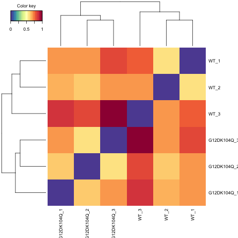

```{r setup, include=FALSE}
knitr::opts_chunk$set(echo = TRUE)
```

# Library loading and set up
```{r message=FALSE, warning=FALSE}
library(DESeq2)
library(tximport)
library(tidyverse)
library(gridExtra)
library(ensembldb)
library(EnsDb.Mmusculus.v79)
library(grid)
library(ggplot2)
library(lattice)
library(reshape)
library(mixOmics)
library(gplots)
library(RColorBrewer)
library(readr)
library(dplyr)
library(VennDiagram)
library(clusterProfiler)
library(DOSE)
library(org.Mm.eg.db)
library(pathview)
library(AnnotationDbi)
library(apeglm)
library(gtools)
library(knitr)
library(biomaRt)
library(fgsea)
library(pheatmap)
library(enrichplot)
```

# Set DEG cutoff values
```{r}
p_value <- 0.05
LFC_CUTOFF <- 1
```


# Compile gene count files in DESeq2 for the whole dataset
This is an RNASeq dataset generated by Moon Hee Yang and the Broad

Samples used here are colonic tumor with different alleles of K-Ras.

Fabp-Cre, Apc fl/+ colonic tumor with K-RasWT, K-RasG12D, K-RasG12D/K104Q

Set working directory to the folder that contains only gene count `sf` files

```{r}
# Generate a tx2gene object for matrix generation
edb <- EnsDb.Mmusculus.v79 
transcriptsID <- as.data.frame(transcripts(edb))
tx2gene <- as.data.frame(cbind(transcriptsID$tx_id, transcriptsID$gene_id))

# Generate DESeqData using the counting result generated using Salmon
countFiles = list.files("Data/Gene Counts/", pattern=".sf$", full.names = TRUE)
basename(countFiles)

names(countFiles) <- c('G12D_1','G12D_2','G12D_3','G12DK104Q_1','G12DK104Q_2','G12DK104Q_3','WT_1','WT_2','WT_3')

txi.salmon <- tximport(countFiles, type = "salmon", tx2gene = tx2gene, ignoreTxVersion = TRUE)

DESeqsampletable <- data.frame(condition = c('control','control','control','experimental','experimental','experimental','experimental','experimental','experimental'))

DESeqsampletable$name <- c('G12D_1','G12D_2','G12D_3','G12DK104Q_1','G12DK104Q_2','G12DK104Q_3','WT_1','WT_2','WT_3')

DESeqsampletable$kras <- c('G12D','G12D','G12D','G12DK104Q','G12DK104Q','G12DK104Q','WT','WT','WT')

DESeqsampletable$gender <- c('M','M','M','F','F','M','M','M','M')

rownames(DESeqsampletable) <- colnames(txi.salmon$counts)

ddsHTSeq<- DESeqDataSetFromTximport(txi.salmon, DESeqsampletable, ~ gender + condition)

ddsHTSeq_norm <- DESeq(ddsHTSeq)
size_factor <- normalizationFactors(ddsHTSeq_norm)
ddsHTSeq_analysis <- lfcShrink(ddsHTSeq_norm,  coef = "condition_experimental_vs_control", type = "apeglm")

DESeq2::plotMA(ddsHTSeq_analysis)
```

# Quality Inspection of the Gene Count Data
## Generate raw count table that contains the simple counts of each gene
Data is transformed and pseudocount is calculated.
```{r}
rawCountTable <- as.data.frame(DESeq2::counts(ddsHTSeq_norm, normalize = TRUE))
pseudoCount = log2(rawCountTable + 1)
grid.arrange(
  ggplot(pseudoCount, aes(x= WT_1)) + xlab(expression(log[2](count + 1))) + ylab("Number of Genes") + 
    geom_histogram(colour = "white", fill = "#525252", binwidth = 0.6) + labs(title = "WT_1"), 
  ggplot(pseudoCount, aes(x= WT_2)) + xlab(expression(log[2](count + 1))) + ylab("Number of Genes") + 
    geom_histogram(colour = "white", fill = "#525252", binwidth = 0.6) + labs(title = "WT_2"),
  ggplot(pseudoCount, aes(x= WT_3)) + xlab(expression(log[2](count + 1))) + ylab("Number of Genes") + 
    geom_histogram(colour = "white", fill = "#525252", binwidth = 0.6) + labs(title = "WT_3"),
  ggplot(pseudoCount, aes(x= G12D_1)) + xlab(expression(log[2](count + 1))) + ylab("Number of Genes") + 
    geom_histogram(colour = "white", fill = "#525252", binwidth = 0.6) + labs(title = "G12D_1"),
  ggplot(pseudoCount, aes(x= G12D_2)) + xlab(expression(log[2](count + 1))) + ylab("Number of Genes") + 
    geom_histogram(colour = "white", fill = "#525252", binwidth = 0.6) + labs(title = "G12D_2"),
  ggplot(pseudoCount, aes(x= G12D_3)) + xlab(expression(log[2](count + 1))) + ylab("Number of Genes") + 
    geom_histogram(colour = "white", fill = "#525252", binwidth = 0.6) + labs(title = "G12D_3"), 
  ggplot(pseudoCount, aes(x= G12DK104Q_1)) + xlab(expression(log[2](count + 1))) + ylab("Number of Genes") + 
    geom_histogram(colour = "white", fill = "#525252", binwidth = 0.6) + labs(title = "G12DK104Q_1"),
  ggplot(pseudoCount, aes(x= G12DK104Q_2)) + xlab(expression(log[2](count + 1))) + ylab("Number of Genes") + 
    geom_histogram(colour = "white", fill = "#525252", binwidth = 0.6) + labs(title = "G12DK104Q_2"),
  ggplot(pseudoCount, aes(x= G12DK104Q_3)) + xlab(expression(log[2](count + 1))) + ylab("Number of Genes") + 
    geom_histogram(colour = "white", fill = "#525252", binwidth = 0.6) + labs(title = "G12DK104Q_3"),
  nrow = 3)
```

## Between-sample distribution
Check on the gene count distribution across all genes.
```{r}
#Boxplots
suppressMessages(df <- melt(pseudoCount, variable_name = "Samples"))
df <- df %>% separate(Samples, into = c("Condition", NA), sep = "_", remove = FALSE)

ggplot(df, aes(x=Samples, y=value, fill = Condition)) + geom_boxplot() + xlab("") + 
  ylab(expression(log[2](count+1))) + scale_fill_manual(values = c("#619CFF", "#F564E3", "#2EF23C")) + theme(axis.text.x = element_text(angle = 90, hjust = 1))

#Histograms and density plots
ggplot(df, aes(x=value, colour = Samples, fill = Samples)) + ylim(c(0, 0.25)) + 
  geom_density(alpha = 0.2, size = 1.25) + facet_wrap(~ Condition) +
  theme(legend.position = "top") + xlab(expression(log[2](count+1)))
```

## Clustering of the sample-to-sample distances
This is the sanity check step to confirm that under a un-supervised clustering, WT and G12D samples will cluster together. For some reason, the code is giving error when try to plot this heatmap in RStudio, so I created a pdf file that contains the heatmap in the Analysis folder named `Hierchical Clustering.pdf`
```{r fig.height=6, fig.width=6}
ddsHTSeq_transform <- varianceStabilizingTransformation(ddsHTSeq_norm)
rawCountTable_transform <- as.data.frame(assay(ddsHTSeq_transform))
rawCountTable_transform_all <- rawCountTable_transform
pseudoCount_transform = log2(rawCountTable_transform + 1)
mat.dist = pseudoCount_transform
mat.dist = as.matrix(dist(t(mat.dist)))
mat.dist = mat.dist/max(mat.dist)
png('Figure/Hierchical_Clustering.png')
cim(mat.dist, symkey = FALSE, margins = c(8, 8))
suppressMessages(dev.off())


```

## Principal component plot of the samples
I performed PCA analysis on all datasets to confirm that samples from the same sample group group together. This step has to be performed using `varianceStabelizingTransformed` dataset, so that the high variance in genes with low counts will not skew the data.

The top 500 most variable genes are selected for PCA analysis.
```{r}
plotPCA(ddsHTSeq_transform, intgroup = "kras", ntop = 500)
```

## Raw data filtering and Generate the raw count file with all detected genes
```{r}
rawCountTable_no_normalization <- as.data.frame(DESeq2::counts(ddsHTSeq))
keep <- rowMeans(rawCountTable[,1:3]) > 50 | rowMeans(rawCountTable[,4:6]) > 50 | rowMeans(rawCountTable[,7:9]) > 50
filterCount <- pseudoCount[keep,]
rawCountTable_transform_all <- rawCountTable_transform_all[keep,]
keep_genes <- rownames(filterCount)
df <- melt(filterCount, variable_name = "Samples")

df <- df %>% separate(Samples, into = c("Condition", NA), sep = "_", remove = FALSE)
detected_raw_count_norm <- rawCountTable[keep,]
write.csv(detected_raw_count_norm, "Result/normalized_gene_counts.csv")
rawCountTable_no_normalization <- rawCountTable_no_normalization[keep,]
write.csv(rawCountTable_no_normalization, "Result/raw_gene_counts.csv")

ggplot(df, aes(x=value, colour = Samples, fill = Samples)) + ylim(c(0, 0.25)) + 
  geom_density(alpha = 0.2, size = 1.25) + facet_wrap(~ Condition) +
  theme(legend.position = "top") + xlab(expression(log[2](count+1)))
```

# G12D vs WT
```{r}
countFiles_ss <- countFiles[c(7,8,9,1,2,3)]
txi.salmon <- tximport(countFiles_ss, type = "salmon", tx2gene = tx2gene, ignoreTxVersion = TRUE)

DESeqsampletable_ss <- DESeqsampletable[c(7,8,9,1,2,3),]
DESeqsampletable_ss$condition <- c("control", "control", "control", "experimental", "experimental", "experimental")

ddsHTSeq<- DESeqDataSetFromTximport(txi.salmon, DESeqsampletable_ss, ~ condition)

raw_ct <- counts(ddsHTSeq)
norm_factor <- size_factor[rownames(size_factor) %in% rownames(raw_ct), c(7,8,9,1,2,3)]
normalizationFactors(ddsHTSeq) <- norm_factor

ddsHTSeq_norm <- DESeq(ddsHTSeq)
ddsHTSeq_analysis <- lfcShrink(ddsHTSeq_norm,  coef = "condition_experimental_vs_control", type = "apeglm")

DESeq2::plotMA(ddsHTSeq_analysis)
```

## Hierchical clustering
```{r}
ddsHTSeq_transform <- varianceStabilizingTransformation(ddsHTSeq_norm)
rawCountTable_transform <- as.data.frame(assay(ddsHTSeq_transform))
pseudoCount_transform = log2(rawCountTable_transform + 1)
mat.dist = pseudoCount_transform
mat.dist = as.matrix(dist(t(mat.dist)))
mat.dist = mat.dist/max(mat.dist)
png('Figure/Hierchical_Clustering_G12D_vs_WT.png')
cim(mat.dist, symkey = FALSE, margins = c(6, 6))
suppressMessages(dev.off())


```

## PCA
```{r}
plotPCA(ddsHTSeq_transform, intgroup = "kras", ntop = 500)
```

## Generate file with differential analysis result
```{r}
ensembl = useMart("ensembl", dataset="mmusculus_gene_ensembl")
symbols = getBM(attributes=c("entrezgene_id", "mgi_symbol", "ensembl_gene_id"), mart=ensembl) %>%
  mutate(entrezgene_id=as.character(entrezgene_id))

dif_analysis <- as.data.frame(ddsHTSeq_analysis)
dif_analysis <- dif_analysis[rownames(dif_analysis) %in% keep_genes, ] 
colnames(dif_analysis) <- paste0("G12D-WT_", colnames(dif_analysis)) 
dif_analysis <- rownames_to_column(dif_analysis, var = "Ensembl_ID")

rawCountTable <- as.data.frame(DESeq2::counts(ddsHTSeq_norm, normalize = TRUE))
detected_rawCountTable <- rawCountTable[rownames(rawCountTable) %in% keep_genes,]
dif_analysis$WT_mean <- rowMeans(detected_rawCountTable[,1:3])
dif_analysis$G12D_mean <- rowMeans(detected_rawCountTable[,4:6])

# calculate signal-to-noise ratio for GSEA later
s2n <- function(num_list, cond_1 = c(4:6), cond_2 = c(1:3)) {
  mean1 <- mean(num_list[cond_1])
  if (mean1 == 0) {
    mean1 = 1
  }
  mean2 <- mean(num_list[cond_2])
  if (mean2 == 0) {
    mean2 = 1
  }
  sd1 <- sd(num_list[cond_1])
  sd2 <- sd(num_list[cond_2])
  sd1 <- min(sd1, 0.2*abs(mean1))
  sd2 <- min(sd2, 0.2*abs(mean2))
  s2nvalue <- (mean1-mean2)/(sd1+sd2)
  return(s2nvalue)
}

dif_analysis$'G12D-WT_s2n' <- apply(detected_rawCountTable,1,s2n,cond_1 = c(4:6),cond_2 = c(1:3))

dif_analysis <- dif_analysis %>% left_join(symbols, by = c("Ensembl_ID" = "ensembl_gene_id")) %>% as_tibble()
dif_analysis <- dif_analysis[!duplicated(dif_analysis$Ensembl_ID), ]
dif_analysis <- dif_analysis[,c(1,10,11,2:9)]
```

## Visualization
### Heatmap
```{r}
suppressMessages(library(mosaic))

rawCountTable_transform_detected <- rawCountTable_transform[rownames(rawCountTable_transform) %in% keep_genes,]

sig_dif <- dif_analysis %>% dplyr::filter(`G12D-WT_padj`< p_value) %>% dplyr::filter(`G12D-WT_log2FoldChange` > LFC_CUTOFF | `G12D-WT_log2FoldChange` < -LFC_CUTOFF) %>% dplyr::select(Ensembl_ID) %>% unique() %>% unlist()
sig_count <- rawCountTable_transform_detected[rownames(rawCountTable_transform_detected) %in% sig_dif, ]

sig_count_z <- t(apply(sig_count,1,zscore))

col_annot <- DESeqsampletable_ss[,c(1,3)]
colnames(col_annot) <- c("Condition", "Kras_status")

p <- pheatmap(sig_count_z, show_rownames = FALSE, annotation_col = col_annot, cluster_cols = FALSE)

ggsave(filename = "Heatmap_G12D_vs_WT.png", p, width = 6, height = 10, path = "Figure")


```

### Volcano Plot
```{r}
# Volcano Plot
ggplot(dif_analysis, aes(x = `G12D-WT_log2FoldChange`, y = -log(`G12D-WT_padj`,10))) +
  xlab("LFC") + ylab("-log10(P value)") + 
  geom_point(data = dif_analysis, alpha = 0.5, size = 1, color = "black") +
  geom_point(data = subset(dif_analysis, `G12D-WT_padj` < p_value & `G12D-WT_log2FoldChange` > LFC_CUTOFF), alpha = 0.5, size = 1, color = "red") +
  geom_point(data = subset(dif_analysis, `G12D-WT_padj` < p_value & `G12D-WT_log2FoldChange` < -LFC_CUTOFF), alpha = 0.5, size = 1, color = "blue") +
  geom_hline(yintercept = -log(p_value,10)) +
  geom_vline(xintercept = c(-LFC_CUTOFF,LFC_CUTOFF)) +
labs(title = "G12D vs WT Volcano Plot")
```

## Pathway enrichment analysis
### GO
Classic GO analysis is performed here for all DE genes detected in this dataset. The reference list is list of genes detected in RNASeq. Three categories of GO terms are tested here, including biological process, molecular function and cellular component.
```{r}
target_gene <- sig_dif
detected_gene <- rownames(detected_rawCountTable)

# Run GO enrichment analysis for biological process
ego_BP <- enrichGO(gene = target_gene, 
                universe = detected_gene,
                keyType = "ENSEMBL",
                OrgDb = org.Mm.eg.db, 
                ont = "BP", 
                pAdjustMethod = "BH", 
                pvalueCutoff = p_value, 
                readable = TRUE)

ego_BP <- pairwise_termsim(ego_BP)

# Output results from GO analysis to a table
cluster_summary_BP <- data.frame(ego_BP)

dir.create("Result/GO", showWarnings = F)
write.csv(cluster_summary_BP, "Result/GO/G12D-WT_GO analysis_BP.csv")

# Run GO enrichment analysis for molecular function 
ego_MF <- enrichGO(gene = target_gene, 
                universe = detected_gene,
                keyType = "ENSEMBL",
                OrgDb = org.Mm.eg.db, 
                ont = "MF", 
                pAdjustMethod = "BH", 
                pvalueCutoff = p_value, 
                readable = TRUE)

ego_MF <- pairwise_termsim(ego_MF)

# Output results from GO analysis to a table
cluster_summary_MF <- data.frame(ego_MF)
write.csv(cluster_summary_MF, "Result/GO/G12D-WT_GO analysis_MF.csv")

# Run GO enrichment analysis for cellular component 
ego_CC <- enrichGO(gene = target_gene, 
                universe = detected_gene,
                keyType = "ENSEMBL",
                OrgDb = org.Mm.eg.db, 
                ont = "CC", 
                pAdjustMethod = "BH", 
                pvalueCutoff = p_value, 
                readable = TRUE)

ego_CC <- pairwise_termsim(ego_CC)

# Output results from GO analysis to a table
cluster_summary_CC <- data.frame(ego_CC)
write.csv(cluster_summary_CC, "Result/GO/G12D-WT_GO analysis_CC.csv")
```

#### Biological process
```{r fig.height=8, fig.width=8}
dotplot(ego_BP, showCategory=25)

emapplot(ego_BP, showCategory = 50)
```

#### Molecular function
```{r fig.height=8, fig.width=8}
dotplot(ego_MF, showCategory=25)

emapplot(ego_MF, showCategory = 50)
```

#### Cellular component
```{r fig.height=8, fig.width=8}
dotplot(ego_CC, showCategory=25)

emapplot(ego_CC, showCategory = 50)
```

### KEGG
```{r fig.height=8, fig.width=8}
target_gene <- dif_analysis %>% dplyr::filter(Ensembl_ID %in% sig_dif) %>% dplyr::select(entrezgene_id) %>% unlist() %>% as.character()
detected_gene <- dif_analysis %>% dplyr::select(entrezgene_id) %>% unlist() %>% as.character()

kk <- enrichKEGG(gene = target_gene, 
                 universe = detected_gene,
                 organism = 'mmu',
                 keyType = "kegg",
                 pAdjustMethod = "BH", 
                 pvalueCutoff = p_value)

kk.result <- as.data.frame(kk)

dir.create("Result/KEGG", showWarnings = FALSE)
write.csv(kk.result, "Result/KEGG/G12D-WT_KEGG analysis.csv")

dotplot(kk, showCategory=25)
```

### GSEA
```{r fig.height=10, fig.width=12}
load("Data/mouse_H_v5p2.rdata")
pathways <- Mm.H

gseadata <- dif_analysis$entrezgene_id
ranks <- dif_analysis$`G12D-WT_s2n`
names(ranks) <- dif_analysis$entrezgene_id
ranks <- sort(ranks, decreasing = T)
fgseaRes <- fgsea(pathways, ranks, minSize=15, maxSize = 500)
fgseaRes <- fgseaRes[fgseaRes$padj < p_value,]
suppressMessages(fgseaRes[, leadingEdge := lapply(leadingEdge, mapIds, x=org.Mm.eg.db, keytype="ENTREZID", column="SYMBOL")])
fgseaRes$leadingEdge <- as.character(fgseaRes$leadingEdge)
fgseaRes <- fgseaRes[order(-fgseaRes$NES), ]

dir.create("Result/GSEA", showWarnings = FALSE)
write.csv(as.data.frame(fgseaRes), "Result/GSEA/G12D-WT_Sig_GSEA_Hallmark.csv")

grid.newpage()
plotGseaTable(pathways[fgseaRes$pathway], ranks, fgseaRes, gseaParam = 0.5) 

dif_analysis_master <- dif_analysis
```

# G12D-K104Q vs G12D
```{r}
countFiles_ss <- countFiles[c(1:6)]
txi.salmon <- tximport(countFiles_ss, type = "salmon", tx2gene = tx2gene, ignoreTxVersion = TRUE)

DESeqsampletable_ss <- DESeqsampletable[c(1:6),]

ddsHTSeq<- DESeqDataSetFromTximport(txi.salmon, DESeqsampletable_ss, ~ condition)

raw_ct <- DESeq2::counts(ddsHTSeq)
norm_factor <- size_factor[rownames(size_factor) %in% rownames(raw_ct), c(1:6)]
normalizationFactors(ddsHTSeq) <- norm_factor

ddsHTSeq_norm <- DESeq(ddsHTSeq)
ddsHTSeq_analysis <- lfcShrink(ddsHTSeq_norm,  coef = "condition_experimental_vs_control", type = "apeglm")

DESeq2::plotMA(ddsHTSeq_analysis)
```

## Hierchical clustering
```{r}
ddsHTSeq_transform <- varianceStabilizingTransformation(ddsHTSeq_norm)
rawCountTable_transform <- as.data.frame(assay(ddsHTSeq_transform))
pseudoCount_transform = log2(rawCountTable_transform + 1)
mat.dist = pseudoCount_transform
mat.dist = as.matrix(dist(t(mat.dist)))
mat.dist = mat.dist/max(mat.dist)
png('Figure/Hierchical_Clustering_G12DK104Q_vs_G12D.png')
cim(mat.dist, symkey = FALSE, margins = c(6, 6))
suppressMessages(dev.off())


```

## PCA
```{r}
plotPCA(ddsHTSeq_transform, intgroup = "kras", ntop = 500)
```

## Generate file with differential analysis result
```{r}
dif_analysis <- as.data.frame(ddsHTSeq_analysis)
dif_analysis <- dif_analysis[rownames(dif_analysis) %in% keep_genes, ] 
colnames(dif_analysis) <- paste0("G12DK104Q-G12D_", colnames(dif_analysis)) 
dif_analysis <- rownames_to_column(dif_analysis, var = "Ensembl_ID")

rawCountTable <- as.data.frame(DESeq2::counts(ddsHTSeq_norm, normalize = TRUE))
detected_rawCountTable <- rawCountTable[rownames(rawCountTable) %in% keep_genes,]
dif_analysis$G12D_mean <- rowMeans(detected_rawCountTable[,1:3])
dif_analysis$G12DK104Q_mean <- rowMeans(detected_rawCountTable[,4:6])

dif_analysis$'G12DK104Q-G12D_s2n' <- apply(detected_rawCountTable,1,s2n,cond_1 = c(4:6),cond_2 = c(1:3))
```

## Visualization
### Heatmap
```{r}
suppressMessages(library(mosaic))

rawCountTable_transform_detected <- rawCountTable_transform[rownames(rawCountTable_transform) %in% keep_genes,]

sig_dif <- dif_analysis %>% dplyr::filter(`G12DK104Q-G12D_padj`< p_value) %>% dplyr::filter(`G12DK104Q-G12D_log2FoldChange` > LFC_CUTOFF | `G12DK104Q-G12D_log2FoldChange` < -LFC_CUTOFF) %>% dplyr::select(Ensembl_ID) %>% unique() %>% unlist()
sig_count <- rawCountTable_transform_detected[rownames(rawCountTable_transform_detected) %in% sig_dif, ]

sig_count_z <- t(apply(sig_count,1,zscore))

col_annot <- DESeqsampletable_ss[,c(1,3)]
colnames(col_annot) <- c("Condition", "Kras_status")

p <- pheatmap(sig_count_z, show_rownames = FALSE, annotation_col = col_annot, cluster_cols = FALSE)

ggsave(filename = "Heatmap_G12DK104Q_vs_G12D.png", p, width = 6, height = 10, path = "Figure")


```

### Volcano Plot
```{r}
# Volcano Plot
ggplot(dif_analysis, aes(x = `G12DK104Q-G12D_log2FoldChange`, y = -log(`G12DK104Q-G12D_padj`,10))) +
  xlab("LFC") + ylab("-log10(P value)") + 
  geom_point(data = dif_analysis, alpha = 0.5, size = 1, color = "black") +
  geom_point(data = subset(dif_analysis, `G12DK104Q-G12D_padj` < p_value & `G12DK104Q-G12D_log2FoldChange` > LFC_CUTOFF), alpha = 0.5, size = 1, color = "red") +
  geom_point(data = subset(dif_analysis, `G12DK104Q-G12D_padj` < p_value & `G12DK104Q-G12D_log2FoldChange` < -LFC_CUTOFF), alpha = 0.5, size = 1, color = "blue") +
  geom_hline(yintercept = -log(p_value,10)) +
  geom_vline(xintercept = c(-LFC_CUTOFF,LFC_CUTOFF)) +
labs(title = "G12DK104Q vs G12D Volcano Plot")
```

## Pathway enrichment analysis
There are only 11 genes used here as input so I'm not expecting a ton of interesting things coming out of this.

### GO
Classic GO analysis is performed here for all DE genes detected in this dataset. The reference list is list of genes detected in RNASeq. Three categories of GO terms are tested here, including biological process, molecular function and cellular component.
```{r}
target_gene <- sig_dif
detected_gene <- rownames(detected_rawCountTable)

# Run GO enrichment analysis for biological process
ego_BP <- enrichGO(gene = target_gene, 
                universe = detected_gene,
                keyType = "ENSEMBL",
                OrgDb = org.Mm.eg.db, 
                ont = "BP", 
                pAdjustMethod = "BH", 
                pvalueCutoff = p_value, 
                readable = TRUE)

# ego_BP <- pairwise_termsim(ego_BP)
# No enrichment found

# Output results from GO analysis to a table
# cluster_summary_BP <- data.frame(ego_BP)

# dir.create("Result/GO", showWarnings = F)
# write.csv(cluster_summary_BP, "Result/GO/G12DK104Q-G12D_GO analysis_BP.csv")

# Run GO enrichment analysis for molecular function 
ego_MF <- enrichGO(gene = target_gene, 
                universe = detected_gene,
                keyType = "ENSEMBL",
                OrgDb = org.Mm.eg.db, 
                ont = "MF", 
                pAdjustMethod = "BH", 
                pvalueCutoff = p_value, 
                readable = TRUE)

ego_MF <- pairwise_termsim(ego_MF)

# Output results from GO analysis to a table
cluster_summary_MF <- data.frame(ego_MF)
write.csv(cluster_summary_MF, "Result/GO/G12DK104Q-G12D_GO analysis_MF.csv")

# Run GO enrichment analysis for cellular component 
ego_CC <- enrichGO(gene = target_gene, 
                universe = detected_gene,
                keyType = "ENSEMBL",
                OrgDb = org.Mm.eg.db, 
                ont = "CC", 
                pAdjustMethod = "BH", 
                pvalueCutoff = p_value, 
                readable = TRUE)

ego_CC <- pairwise_termsim(ego_CC)

# Output results from GO analysis to a table
cluster_summary_CC <- data.frame(ego_CC)
write.csv(cluster_summary_CC, "Result/GO/G12DK104Q-G12D_GO analysis_CC.csv")
```

#### Biological process
```{r fig.height=8, fig.width=8}
# dotplot(ego_BP, showCategory=25)

# emapplot(ego_BP, showCategory = 50)
```

#### Molecular function
```{r fig.height=8, fig.width=8}
# dotplot(ego_MF, showCategory=25)

# emapplot(ego_MF, showCategory = 50)
```

#### Cellular component
```{r fig.height=8, fig.width=8}
# dotplot(ego_CC, showCategory=25)

# emapplot(ego_CC, showCategory = 50)
```

### KEGG
```{r fig.height=8, fig.width=8}
target_gene <- dif_analysis_master %>% dplyr::filter(Ensembl_ID %in% sig_dif) %>% dplyr::select(entrezgene_id) %>% unlist() %>% as.character()
detected_gene <- dif_analysis_master %>% dplyr::select(entrezgene_id) %>% unlist() %>% as.character()

kk <- enrichKEGG(gene = target_gene, 
                 universe = detected_gene,
                 organism = 'mmu',
                 keyType = "kegg",
                 pAdjustMethod = "BH", 
                 pvalueCutoff = p_value)

kk.result <- as.data.frame(kk)

dir.create("Result/KEGG", showWarnings = FALSE)
write.csv(kk.result, "Result/KEGG/G12DK104Q-G12D_KEGG analysis.csv")

# dotplot(kk, showCategory=25)
```

### GSEA
```{r fig.height=10, fig.width=12}
gseadata <- dif_analysis_master$entrezgene_id
ranks <- dif_analysis$`G12DK104Q-G12D_s2n`
names(ranks) <- dif_analysis_master$entrezgene_id
ranks <- sort(ranks, decreasing = T)
fgseaRes <- fgsea(pathways, ranks, minSize=15, maxSize = 500)
fgseaRes <- fgseaRes[fgseaRes$padj < p_value,]
suppressMessages(fgseaRes[, leadingEdge := lapply(leadingEdge, mapIds, x=org.Mm.eg.db, keytype="ENTREZID", column="SYMBOL")])
fgseaRes$leadingEdge <- as.character(fgseaRes$leadingEdge)
fgseaRes <- fgseaRes[order(-fgseaRes$NES), ]

dir.create("Result/GSEA", showWarnings = FALSE)
write.csv(as.data.frame(fgseaRes), "Result/GSEA/G12DK104Q-G12D_Sig_GSEA_Hallmark.csv")

grid.newpage()
plotGseaTable(pathways[fgseaRes$pathway], ranks, fgseaRes, gseaParam = 0.5) 

dif_analysis_master <- left_join(dif_analysis_master, dif_analysis, by = c('Ensembl_ID'='Ensembl_ID'))
```


# G12D-K104Q vs WT
```{r}
countFiles_ss <- countFiles[c(4:9)]
txi.salmon <- tximport(countFiles_ss, type = "salmon", tx2gene = tx2gene, ignoreTxVersion = TRUE)

DESeqsampletable_ss <- DESeqsampletable[c(4:9),]
DESeqsampletable_ss$condition <- c(rep("experimental", 3), rep("control", 3))

ddsHTSeq<- DESeqDataSetFromTximport(txi.salmon, DESeqsampletable_ss, ~ condition)

raw_ct <- DESeq2::counts(ddsHTSeq)
norm_factor <- size_factor[rownames(size_factor) %in% rownames(raw_ct), c(4:9)]
normalizationFactors(ddsHTSeq) <- norm_factor

ddsHTSeq_norm <- DESeq(ddsHTSeq)
ddsHTSeq_analysis <- lfcShrink(ddsHTSeq_norm,  coef = "condition_experimental_vs_control", type = "apeglm")

DESeq2::plotMA(ddsHTSeq_analysis)
```

## Hierchical clustering
```{r}
ddsHTSeq_transform <- varianceStabilizingTransformation(ddsHTSeq_norm)
rawCountTable_transform <- as.data.frame(assay(ddsHTSeq_transform))
pseudoCount_transform = log2(rawCountTable_transform + 1)
mat.dist = pseudoCount_transform
mat.dist = as.matrix(dist(t(mat.dist)))
mat.dist = mat.dist/max(mat.dist)
png('Figure/Hierchical_Clustering_G12DK104Q_vs_WT.png')
cim(mat.dist, symkey = FALSE, margins = c(6, 6))
suppressMessages(dev.off())


```

## PCA
```{r}
plotPCA(ddsHTSeq_transform, intgroup = "kras", ntop = 500)
```

## Generate file with differential analysis result
```{r}
dif_analysis <- as.data.frame(ddsHTSeq_analysis)
dif_analysis <- dif_analysis[rownames(dif_analysis) %in% keep_genes, ] 
colnames(dif_analysis) <- paste0("G12DK104Q-WT_", colnames(dif_analysis)) 
dif_analysis <- rownames_to_column(dif_analysis, var = "Ensembl_ID")

rawCountTable <- as.data.frame(DESeq2::counts(ddsHTSeq_norm, normalize = TRUE))
detected_rawCountTable <- rawCountTable[rownames(rawCountTable) %in% keep_genes,]
dif_analysis$WT_mean <- rowMeans(detected_rawCountTable[,4:6])
dif_analysis$G12DK104Q_mean <- rowMeans(detected_rawCountTable[,1:3])

dif_analysis$'G12DK104Q-WT_s2n' <- apply(detected_rawCountTable,1,s2n,cond_1 = c(1:3),cond_2 = c(4:6))
```

## Visualization
### Heatmap
```{r}
suppressMessages(library(mosaic))

rawCountTable_transform_detected <- rawCountTable_transform[rownames(rawCountTable_transform) %in% keep_genes,]

sig_dif <- dif_analysis %>% dplyr::filter(`G12DK104Q-WT_padj`< p_value) %>% dplyr::filter(`G12DK104Q-WT_log2FoldChange` > LFC_CUTOFF | `G12DK104Q-WT_log2FoldChange` < -LFC_CUTOFF) %>% dplyr::select(Ensembl_ID) %>% unique() %>% unlist()
sig_count <- rawCountTable_transform_detected[rownames(rawCountTable_transform_detected) %in% sig_dif, ]

sig_count_z <- t(apply(sig_count,1,zscore))

col_annot <- DESeqsampletable_ss[,c(1,3)]
colnames(col_annot) <- c("Condition", "Kras_status")

p <- pheatmap(sig_count_z, show_rownames = FALSE, annotation_col = col_annot, cluster_cols = FALSE)

ggsave(filename = "Heatmap_G12DK104Q_vs_WT.png", p, width = 6, height = 10, path = "Figure")


```

### Volcano Plot
```{r}
# Volcano Plot
ggplot(dif_analysis, aes(x = `G12DK104Q-WT_log2FoldChange`, y = -log(`G12DK104Q-WT_padj`,10))) +
  xlab("LFC") + ylab("-log10(P value)") + 
  geom_point(data = dif_analysis, alpha = 0.5, size = 1, color = "black") +
  geom_point(data = subset(dif_analysis, `G12DK104Q-WT_padj` < p_value & `G12DK104Q-WT_log2FoldChange` > LFC_CUTOFF), alpha = 0.5, size = 1, color = "red") +
  geom_point(data = subset(dif_analysis, `G12DK104Q-WT_padj` < p_value & `G12DK104Q-WT_log2FoldChange` < -LFC_CUTOFF), alpha = 0.5, size = 1, color = "blue") +
  geom_hline(yintercept = -log(p_value,10)) +
  geom_vline(xintercept = c(-LFC_CUTOFF,LFC_CUTOFF)) +
labs(title = "G12DK104Q vs WT Volcano Plot")
```

## Pathway enrichment analysis
There are only 11 genes used here as input so I'm not expecting a ton of interesting things coming out of this.

### GO
Classic GO analysis is performed here for all DE genes detected in this dataset. The reference list is list of genes detected in RNASeq. Three categories of GO terms are tested here, including biological process, molecular function and cellular component.
```{r}
target_gene <- sig_dif
detected_gene <- rownames(detected_rawCountTable)

# Run GO enrichment analysis for biological process
ego_BP <- enrichGO(gene = target_gene, 
                universe = detected_gene,
                keyType = "ENSEMBL",
                OrgDb = org.Mm.eg.db, 
                ont = "BP", 
                pAdjustMethod = "BH", 
                pvalueCutoff = p_value, 
                readable = TRUE)

ego_BP <- pairwise_termsim(ego_BP)

# Output results from GO analysis to a table
cluster_summary_BP <- data.frame(ego_BP)

dir.create("Result/GO", showWarnings = F)
write.csv(cluster_summary_BP, "Result/GO/G12DK104Q-WT_GO analysis_BP.csv")

# Run GO enrichment analysis for molecular function 
ego_MF <- enrichGO(gene = target_gene, 
                universe = detected_gene,
                keyType = "ENSEMBL",
                OrgDb = org.Mm.eg.db, 
                ont = "MF", 
                pAdjustMethod = "BH", 
                pvalueCutoff = p_value, 
                readable = TRUE)

ego_MF <- pairwise_termsim(ego_MF)

# Output results from GO analysis to a table
cluster_summary_MF <- data.frame(ego_MF)
write.csv(cluster_summary_MF, "Result/GO/G12DK104Q-WT_GO analysis_MF.csv")

# Run GO enrichment analysis for cellular component 
ego_CC <- enrichGO(gene = target_gene, 
                universe = detected_gene,
                keyType = "ENSEMBL",
                OrgDb = org.Mm.eg.db, 
                ont = "CC", 
                pAdjustMethod = "BH", 
                pvalueCutoff = p_value, 
                readable = TRUE)

ego_CC <- pairwise_termsim(ego_CC)

# Output results from GO analysis to a table
cluster_summary_CC <- data.frame(ego_CC)
write.csv(cluster_summary_CC, "Result/GO/G12DK104Q-WT_GO analysis_CC.csv")
```

#### Biological process
```{r fig.height=8, fig.width=8}
dotplot(ego_BP, showCategory=25)

emapplot(ego_BP, showCategory = 50)
```

#### Molecular function
```{r fig.height=8, fig.width=8}
dotplot(ego_MF, showCategory=25)

emapplot(ego_MF, showCategory = 50)
```

#### Cellular component
```{r fig.height=8, fig.width=8}
dotplot(ego_CC, showCategory=25)

emapplot(ego_CC, showCategory = 50)
```

### KEGG
```{r fig.height=8, fig.width=8}
target_gene <- dif_analysis_master %>% dplyr::filter(Ensembl_ID %in% sig_dif) %>% dplyr::select(entrezgene_id) %>% unlist() %>% as.character()
detected_gene <- dif_analysis_master %>% dplyr::select(entrezgene_id) %>% unlist() %>% as.character()

kk <- enrichKEGG(gene = target_gene, 
                 universe = detected_gene,
                 organism = 'mmu',
                 keyType = "kegg",
                 pAdjustMethod = "BH", 
                 pvalueCutoff = p_value)

kk.result <- as.data.frame(kk)

#dir.create("Result/KEGG", showWarnings = FALSE)
#write.csv(kk.result, "Result/KEGG/G12DK104Q-WT_KEGG analysis.csv")

# dotplot(kk, showCategory=25)
```

### GSEA
```{r fig.height=10, fig.width=12}
gseadata <- dif_analysis_master$entrezgene_id
ranks <- dif_analysis$`G12DK104Q-WT_s2n`
names(ranks) <- dif_analysis_master$entrezgene_id
ranks <- sort(ranks, decreasing = T)
fgseaRes <- fgsea(pathways, ranks, minSize=15, maxSize = 500)
fgseaRes <- fgseaRes[fgseaRes$padj < p_value,]
suppressMessages(fgseaRes[, leadingEdge := lapply(leadingEdge, mapIds, x=org.Mm.eg.db, keytype="ENTREZID", column="SYMBOL")])
fgseaRes$leadingEdge <- as.character(fgseaRes$leadingEdge)
fgseaRes <- fgseaRes[order(-fgseaRes$NES), ]

dir.create("Result/GSEA", showWarnings = FALSE)
write.csv(as.data.frame(fgseaRes), "Result/GSEA/G12DK104Q-WT_Sig_GSEA_Hallmark.csv")

grid.newpage()
plotGseaTable(pathways[fgseaRes$pathway], ranks, fgseaRes, gseaParam = 0.5) 

dif_analysis_master <- left_join(dif_analysis_master, dif_analysis, by = c('Ensembl_ID'='Ensembl_ID'))
```


# Export DGE analysis master datasheet
```{r}
write_csv(dif_analysis_master, "Result/Differential_analysis.csv")
```

# Geenrate heatmap for the paper

## DEGs overlap between G12D vs WT and G12D-K104Q vs G12D
```{r}
G12D_WT_DEG <- dif_analysis_master %>% dplyr::filter(`G12D-WT_padj`< p_value) %>% dplyr::filter(`G12D-WT_log2FoldChange` > LFC_CUTOFF | `G12D-WT_log2FoldChange` < -LFC_CUTOFF) %>% dplyr::select(Ensembl_ID) %>% unique() %>% unlist()

G12DK104Q_G12D_DEG  <- dif_analysis_master %>% dplyr::filter(`G12DK104Q-G12D_padj`< p_value) %>% dplyr::filter(`G12DK104Q-G12D_log2FoldChange` > LFC_CUTOFF | `G12DK104Q-G12D_log2FoldChange` < -LFC_CUTOFF) %>% dplyr::select(Ensembl_ID) %>% unique() %>% unlist()

overlap <- intersect(G12D_WT_DEG, G12DK104Q_G12D_DEG)
grid.newpage()
v <- draw.pairwise.venn(length(G12D_WT_DEG),
                  length(G12DK104Q_G12D_DEG),
                  length(overlap),
                  catergory <- c("G12D_WT_DEG",
                                 "G12DK104Q_G12D_DEG"),
                  lty = "blank",
                  ex.text = FALSE,
                  fill = c("pink", "lightblue"),
                  cat.pos = c(250, 135), cat.dist = 0.1, margin = 0.1,
                  fontfamily = "sans", cat.fontfamily = "sans")

ggsave(filename = "Venn_G12DK104Q_vs_G12D overlap with G12D_vs_WT.pdf", v, width = 6, height = 4, path = "Figure", device = "pdf")


overlap_count <- rawCountTable_transform_all[rownames(rawCountTable_transform_all) %in% overlap, ]

overlap_count_z <- t(apply(overlap_count,1,zscore))
overlap_count_z <- overlap_count_z[,c(7:9, 1:6)]

col_annot <- DESeqsampletable[,c(3,4)]
colnames(col_annot) <- c("Kras_status", "Gender")

p <- pheatmap(overlap_count_z, show_rownames = FALSE, annotation_col = col_annot, cluster_cols = FALSE)

ggsave(filename = "Heatmap_G12DK104Q_vs_G12D overlap with G12D_vs_WT.pdf", p, width = 6, height = 4, path = "Figure", device = "pdf")

# include_graphics("Figure/Heatmap_G12DK104Q_vs_G12D overlap with G12D_vs_WT.pdf")
```


## DEGs overlap between G12D vs WT and G12D-K104Q vs WT
```{r}
G12D_WT_DEG <- dif_analysis_master %>% dplyr::filter(`G12D-WT_padj`< p_value) %>% dplyr::filter(`G12D-WT_log2FoldChange` > LFC_CUTOFF | `G12D-WT_log2FoldChange` < -LFC_CUTOFF) %>% dplyr::select(Ensembl_ID) %>% unique() %>% unlist()

G12DK104Q_WT_DEG  <- dif_analysis_master %>% dplyr::filter(`G12DK104Q-WT_padj`< p_value) %>% dplyr::filter(`G12DK104Q-WT_log2FoldChange` > LFC_CUTOFF | `G12DK104Q-WT_log2FoldChange` < -LFC_CUTOFF) %>% dplyr::select(Ensembl_ID) %>% unique() %>% unlist()

overlap <- intersect(G12D_WT_DEG, G12DK104Q_WT_DEG)
grid.newpage()
v <- draw.pairwise.venn(length(G12D_WT_DEG),
                  length(G12DK104Q_WT_DEG),
                  length(overlap),
                  catergory <- c("G12D_WT_DEG",
                                 "G12DK104Q_WT_DEG"),
                  lty = "blank",
                  ex.text = FALSE,
                  fill = c("pink", "lightblue"),
                  cat.pos = c(250, 135), cat.dist = 0.1, margin = 0.1,
                  fontfamily = "sans", cat.fontfamily = "sans")

ggsave(filename = "Venn_G12DK104Q_vs_WT overlap with G12D_vs_WT.pdf", v, width = 6, height = 4, path = "Figure", device = "pdf")


overlap_count <- rawCountTable_transform_all[rownames(rawCountTable_transform_all) %in% overlap, ]

overlap_count_z <- t(apply(overlap_count,1,zscore))
overlap_count_z <- overlap_count_z[,c(7:9, 1:6)]

col_annot <- DESeqsampletable[,c(3,4)]
colnames(col_annot) <- c("Kras_status", "Gender")

p <- pheatmap(overlap_count_z, show_rownames = FALSE, annotation_col = col_annot, cluster_cols = FALSE)

ggsave(filename = "Heatmap_G12DK104Q_vs_WT overlap with G12D_vs_WT.pdf", p, width = 6, height = 8, path = "Figure", device = "pdf")

# include_graphics("Figure/Heatmap_G12DK104Q_vs_WT overlap with G12D_vs_WT.pdf")
```


## Just looking at DEGs in G12D-K104Q vs WT

```{r}
G12DK104Q_WT_DEG  <- dif_analysis_master %>% dplyr::filter(`G12DK104Q-WT_padj`< p_value) %>% dplyr::filter(`G12DK104Q-WT_log2FoldChange` > LFC_CUTOFF | `G12DK104Q-WT_log2FoldChange` < -LFC_CUTOFF) %>% dplyr::select(Ensembl_ID) %>% unique() %>% unlist()


overlap_count <- rawCountTable_transform_all[rownames(rawCountTable_transform_all) %in% G12DK104Q_WT_DEG, ]

overlap_count_z <- t(apply(overlap_count,1,zscore))
overlap_count_z <- overlap_count_z[,c(7:9, 1:6)]

col_annot <- DESeqsampletable[,c(3,4)]
colnames(col_annot) <- c("Kras_status", "Gender")

p <- pheatmap(overlap_count_z, show_rownames = FALSE, annotation_col = col_annot, cluster_cols = FALSE)

ggsave(filename = "Heatmap_G12DK104Q_vs_WT with all samples.pdf", p, width = 6, height = 8, path = "Figure", device = "pdf")

```


# SessionInfo
```{r}
sessionInfo()
```


